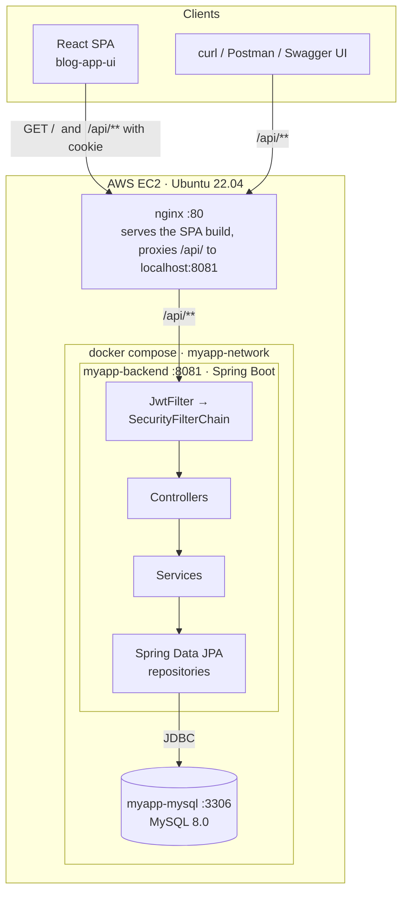
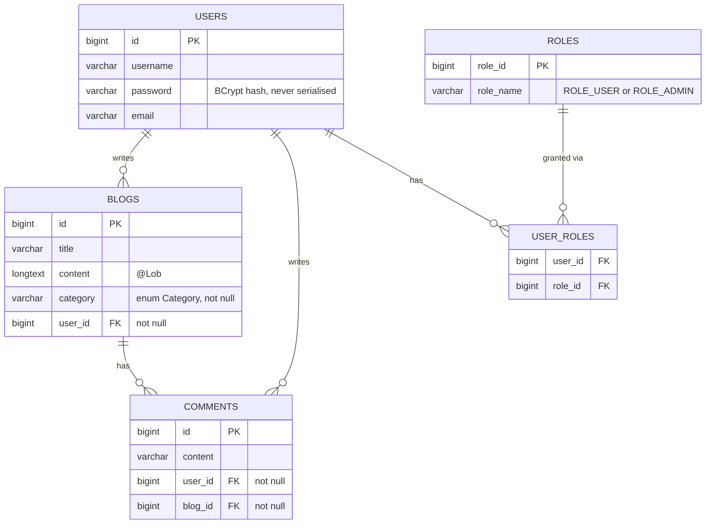
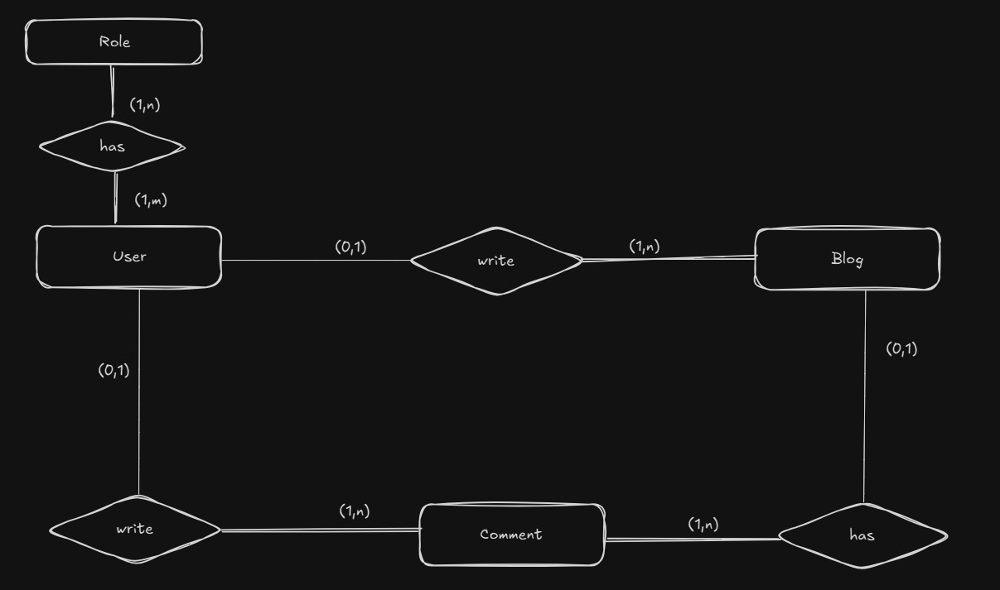
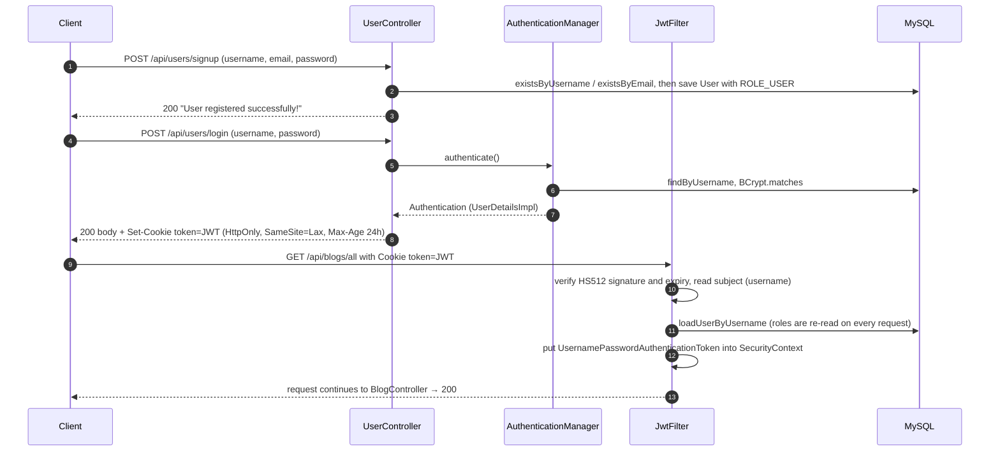
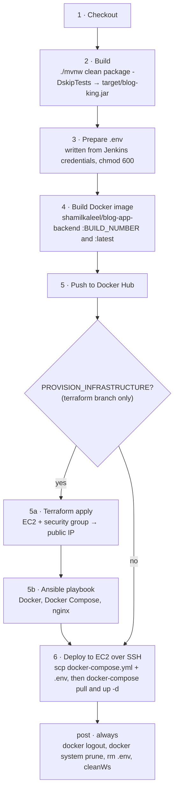
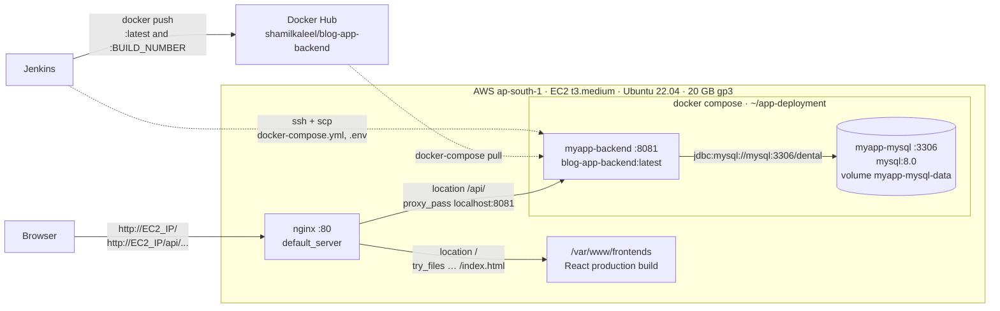

# ArticleHub — Backend API (`Blog-app`)


> A blogging-platform REST API built with **Spring Boot 3 / Java 17**, secured with **JWT-in-HttpOnly-cookie** authentication and role-based access, and delivered end-to-end by a **Jenkins → Docker Hub → Terraform → Ansible → AWS EC2** pipeline.
>
> Built as a hands-on project for learning DevOps: the application is deliberately small so that the full path from `git push` to a provisioned, configured, running cloud server can be understood in one sitting.

- **Frontend:** [`ShamilKaleel/blog-app-ui`](https://github.com/ShamilKaleel/blog-app-ui) (React + Vite) — documented in its own repository.
- **Image:** [`shamilkaleel/blog-app-backend`](https://hub.docker.com/r/shamilkaleel/blog-app-backend) on Docker Hub.

---

## Table of contents

- [Overview](#overview)
- [What this project demonstrates](#what-this-project-demonstrates)
- [Tech stack](#tech-stack)
- [Architecture](#architecture)
- [Data model](#data-model)
- [Authentication & authorization](#authentication--authorization)
- [API reference](#api-reference)
- [Configuration](#configuration)
- [Getting started](#getting-started)
- [Build & test](#build--test)
- [Containerisation](#containerisation)
- [CI/CD pipeline (Jenkins)](#cicd-pipeline-jenkins)
- [Cloud deployment (AWS)](#cloud-deployment-aws)
- [Known limitations & roadmap](#known-limitations--roadmap)
- [Project history](#project-history)
- [Related repositories](#related-repositories)

---

## Overview

**What the application does**

- Visitors **sign up** and **log in**; a successful login sets an `HttpOnly` cookie containing a signed JWT.
- Authenticated users **write blog posts** in one of eight categories, **read** every post, and **filter** posts by category or by author.
- Authenticated users **comment** on posts; comments are deleted with their post.
- Users hold roles (`ROLE_USER`, `ROLE_ADMIN`); admins can list every registered user.
- The API is self-documented with **Swagger UI** (springdoc-openapi).

**How it is delivered**

- The app is packaged as a Docker image and run next to **MySQL 8** with Docker Compose; the app container waits for the database to be healthy before starting.
- A **Jenkins declarative pipeline** builds the jar, bakes the image, tags it with the build number, pushes it to Docker Hub, and deploys it to an **Ubuntu EC2** host over SSH.
- On the [`terraform`](https://github.com/ShamilKaleel/Blog-app/tree/terraform) branch the same pipeline first **provisions the EC2 instance with Terraform** and **configures it with Ansible** (Docker, Docker Compose, and an nginx reverse proxy that serves the React frontend and forwards `/api/` to the backend).

## What this project demonstrates

| Area | What is in this repository |
|---|---|
| **Backend engineering** | Layered Spring Boot API (controller → service → repository), Spring Data JPA over MySQL, Bean Validation, a global `@ControllerAdvice` error format, request/response DTOs, OpenAPI documentation |
| **Security** | Stateless **HS512 JWT** issued as an `HttpOnly`/`SameSite=Lax` cookie, BCrypt password hashing, a custom `OncePerRequestFilter`, URL-based role authorization, a JSON `401` entry point, configurable CORS |
| **12-factor configuration** | Every runtime value (ports, datasource, JWT secret, CORS) comes from environment variables or a `.env` file — nothing environment-specific is committed |
| **Containers** | `Dockerfile`, a wait-for-MySQL `entrypoint.sh`, and a Compose stack with a health-check-gated `depends_on`, a named volume and a private bridge network |
| **CI/CD** | Parameterised `Jenkinsfile` with credential binding, per-build image tags, Docker Hub push, an SSH/SCP deploy step and a `post` block that scrubs secrets from the agent |
| **Infrastructure as Code** | Terraform (EC2 instance, security group, outputs) and Ansible (Docker, Compose, nginx vhost) with the inventory generated at run time from Terraform output |
| **Workflow** | Feature branches merged through pull requests (`jwt_in_header` → `jwt_in_cookie` → `dev` → `devops` → `terraform`) |

## Tech stack

| Layer | Technology | Version |
|---|---|---|
| Language / runtime | Java (OpenJDK) | 17 |
| Framework | Spring Boot (`spring-boot-starter-parent`) | 3.4.1 |
| Web | Spring MVC (`spring-boot-starter-web`) | managed |
| Persistence | Spring Data JPA + Hibernate, MySQL Connector/J | managed |
| Security | Spring Security, JJWT (`jjwt-api`, `jjwt-impl`, `jjwt-jackson`) | 0.11.5 |
| Validation | Bean Validation (`spring-boot-starter-validation`) | managed |
| API docs | springdoc-openapi (`springdoc-openapi-starter-webmvc-ui`) | 2.8.4 |
| Config | dotenv-java (loads `.env` into system properties) | 2.2.0 |
| Mapping / boilerplate | ModelMapper, Lombok | 3.0.0, 1.18.30 |
| Build | Maven Wrapper 3.3.2 → Apache Maven 3.9.9, `spring-boot-maven-plugin` | — |
| Database | MySQL | 8.0 (Docker image) |
| Containers | Docker, Docker Compose (v2 binary, installed as `docker-compose`) | — |
| CI/CD | Jenkins (declarative pipeline), Docker Hub | — |
| Infrastructure | Terraform (AWS provider), Ansible, AWS EC2 (`ap-south-1`), nginx | — |

The built artifact is **`target/blog-king.jar`** — `pom.xml` sets `<finalName>blog-king</finalName>`, so do not look for `blog-app-0.0.1-SNAPSHOT.jar`.

## Architecture

### Request path



Locally there is no nginx: clients call `http://localhost:8081/api/...` directly.

### Layers

| Layer | Package | Responsibility |
|---|---|---|
| Entry point | `org.ruhuna.blogapp.BlogAppApplication` | Loads `.env` into JVM system properties (dotenv-java), then starts Spring Boot |
| Web | `controller` | `BlogController`, `CommentController`, `UserController` (auth), `TestController`; maps HTTP ↔ DTOs, sets status codes |
| Contracts | `payload`, `security.request`, `security.response` | Request DTOs with Bean Validation, response DTOs, `ErrorResponse` |
| Business logic | `service` (implementations) and `service.impl` (interfaces — note the inverted naming) | Lookups, validation, entity ↔ DTO mapping, `ResourceNotFoundException` on misses |
| Persistence | `repository` | Spring Data `JpaRepository` interfaces with derived queries (`findByCategory`, `findByUser`, `findByBlogId`, `findByUsername`, …) |
| Domain | `model` | JPA entities `User`, `Role`, `Blog`, `Comment` and enums `AppRole`, `Category` |
| Security | `security`, `security.jwt`, `security.service` | `WebSecurityConfig` (filter chain, CORS, beans, data seeding), `JwtUtils`, `JwtFilter`, `UserDetailsImpl`, `UserDetailsServiceImpl` |
| Cross-cutting | `exceptions`, `config`, `mapper` | Global exception handler, JSON `401` entry point, `ModelMapper` bean, `CommentMapper` |

### Repository layout

```
Blog-app/
├── src/main/java/org/ruhuna/blogapp/
│   ├── BlogAppApplication.java      # entry point — loads .env, runs Spring Boot
│   ├── config/                      # ModelMapperConfig
│   ├── controller/                  # BlogController, CommentController, UserController, TestController
│   ├── exceptions/                  # MyGlobalExceptionHandler, CustomBasicAuthenticationEntryPoint, ...
│   ├── mapper/                      # CommentMapper
│   ├── model/                       # User, Role, AppRole, Blog, Comment, Category
│   ├── payload/                     # CreateBlogDTO, BlogResponseDTO, CreateCommentDTO, ..., ErrorResponse
│   ├── repository/                  # UserRepository, RoleRepository, BlogRepository, CommentRepository
│   ├── security/
│   │   ├── WebSecurityConfig.java   # filter chain, CORS, PasswordEncoder, role/user seeding
│   │   ├── jwt/                     # JwtUtils (issue + validate), JwtFilter (per-request auth)
│   │   ├── request/                 # LoginRequest, SignupRequest
│   │   ├── response/                # UserInfoResponse, MessageResponse
│   │   └── service/                 # UserDetailsImpl, UserDetailsServiceImpl
│   └── service/                     # BlogService, CommentService  (impl/ holds the interfaces)
├── src/main/resources/application.properties   # every value comes from an env var
├── src/test/java/.../BlogAppApplicationTests.java  # contextLoads() only
├── Dockerfile · entrypoint.sh · docker-compose.yml
├── Jenkinsfile                      # CI/CD — build, image, push, deploy over SSH
├── terraform/  ansible/             # ⚠ only on the `terraform` branch (see Cloud deployment)
├── ER.jpg                           # hand-drawn ER diagram
└── pom.xml · mvnw · mvnw.cmd
```

## Data model

Hibernate generates the schema (`spring.jpa.hibernate.ddl-auto=update`). The tables it creates:



| Entity | Table | Notable mapping details |
|---|---|---|
| `User` | `users` | `roles` is `@ManyToMany(fetch = EAGER, cascade = {PERSIST, MERGE})` through join table `user_roles`; `password` is `@JsonIgnore`. Uniqueness of `username`/`email` is enforced in `UserController.registerUser`, not by a DB constraint |
| `Role` | `roles` | `roleName` is `@Enumerated(STRING)` of `AppRole { ROLE_USER, ROLE_ADMIN }`, `length = 20` |
| `Blog` | `blogs` | `content` is `@Lob` (LONGTEXT); `user` is `@ManyToOne` (`user_id`, not null); `comments` is `@OneToMany(mappedBy = "blog", cascade = ALL)` so deleting a blog deletes its comments; `category` is `@Enumerated(STRING)` of `Category` |
| `Comment` | `comments` | `@ManyToOne` to both `User` (`user_id`) and `Blog` (`blog_id`), both `nullable = false`; `content` is a plain `VARCHAR(255)` |

`Category` values: `TECHNOLOGY`, `HEALTH`, `LIFESTYLE`, `EDUCATION`, `BUSINESS`, `SPORTS`, `ENTERTAINMENT`, `OTHERS`.

The original hand-drawn ER diagram from the design phase is kept in the repo:



## Authentication & authorization

> **The JWT travels in a cookie, not in an `Authorization: Bearer` header.**
>
> `JwtFilter` reads the token **only** from the cookie named by `SPRING_APP_JWTCOOKIENAME` (`token` in the deployed configuration). Browser clients must send requests with credentials (`axios` → `withCredentials: true`, `fetch` → `credentials: "include"`); `curl` users should keep a cookie jar (`-c cookies.txt` on login, `-b cookies.txt` afterwards). There is no bearer-header support.

### Flow



### Token & cookie details (`security/jwt/JwtUtils.java`)

| Aspect | Value |
|---|---|
| Algorithm | HS512 — key is `Base64-decode(SPRING_APP_JWTSECRET)`, must be ≥ 64 bytes |
| Claims | `sub` = username, `iat`, `exp` = now + `SPRING_APP_JWTEXPIRATIONMS`. **No roles in the token** — authorities are loaded from the DB per request |
| Cookie | name `SPRING_APP_JWTCOOKIENAME`, `Path=/`, `Max-Age=86400` (hard-coded 24 h), `HttpOnly`, `SameSite=Lax`, `Secure` = `spring.app.cookieSecure` (currently pinned to `false`) |
| Logout | `POST /api/users/logout` responds with the same cookie set to empty and `Max-Age=0`; the token itself is not revoked server-side |
| Invalid / expired token | `JwtFilter` logs and continues **anonymously**, so protected routes answer `401` from `CustomBasicAuthenticationEntryPoint` |
| Sessions / CSRF | `SessionCreationPolicy.STATELESS`; CSRF protection disabled; `X-Frame-Options: SAMEORIGIN` |

### Access rules (`security/WebSecurityConfig.java`)

| Path | Rule |
|---|---|
| `/api/users/login`, `/api/users/signup`, `/api/users/logout` | public (any method) |
| `/swagger-ui/**`, `/swagger-ui.html`, `/v3/api-docs/**`, `/webjars/**` (and legacy Swagger paths) | public |
| `GET /api/users/users` | `hasAnyRole("ADMIN")` → needs `ROLE_ADMIN` |
| `GET /api/test/` | *intended* public, but the matcher is written `api/test/` without a leading slash — treat it as authenticated |
| **everything else** (`/api/blogs/**`, `/api/comments/**`, `/api/users/user`) | any authenticated user |

Roles are the `AppRole` enum names (`ROLE_USER`, `ROLE_ADMIN`) used directly as authorities. There is no method-level security (`@PreAuthorize`) — authorization is purely URL-based, and **there are no per-record ownership checks** (see [Known limitations](#known-limitations--roadmap)).

### CORS

Configured for `/api/**` only: origins from `APP_CORS_ALLOWED_ORIGINS` (comma-separated), methods `GET, POST, PUT, DELETE, OPTIONS`, all headers, `allowCredentials = true`, exposed header `Authorization`. Because credentials are allowed, **origins must be listed explicitly** — Spring rejects the wildcard `*` for credentialed CORS requests (it only works in production because nginx serves the frontend and the API from the same origin, so the browser never makes a cross-origin call).

### Seeded accounts

A `CommandLineRunner` in `WebSecurityConfig` runs on **every start-up**: it creates the two roles if missing, creates these users if missing, and (re-)assigns their roles:

| Username | Password | Email | Roles |
|---|---|---|---|
| `user` | `userPass` | `user@example.com` | `ROLE_USER` |
| `admin` | `adminPass` | `admin@example.com` | `ROLE_USER`, `ROLE_ADMIN` |

Handy for local testing; a liability in production (see limitations).

## API reference

Base URL: `http://localhost:8081` locally, `http://<EC2_PUBLIC_IP>` (via nginx) in production.
Interactive docs: **`/swagger-ui.html`** (redirects to `/swagger-ui/index.html`); raw spec: **`/v3/api-docs`**. Both are public.

All request and response bodies are JSON. **Auth** column: `public`, `user` (any authenticated user), `admin` (`ROLE_ADMIN`).

### Users & authentication — `/api/users`

| Method | Path | Auth | Body | Success | Errors |
|---|---|---|---|---|---|
| `POST` | `/api/users/signup` | public | `SignupRequest` | `200` `{"message":"User registered successfully!"}` | `400` `{"message":"Error: Username is already taken!"}` / `"Error: Email is already in use!"`; `400` validation |
| `POST` | `/api/users/login` | public | `LoginRequest` | `200` `UserInfoResponse` **+ `Set-Cookie`** | `401` `{"message":"Bad credentials","status":false}` |
| `POST` | `/api/users/logout` | public | — | `200` `{"message":"You've been signed out!"}` + expired cookie | — |
| `GET` | `/api/users/user` | user | — | `200` `UserInfoResponse` of the caller (`jwtToken` is `null`) | `401` |
| `GET` | `/api/users/users` | admin | — | `200` `[UserResponseDTO]` | `401`, `403` (empty body) |

- **`SignupRequest`** — `username` (3–20 chars), `email` (valid, ≤ 50), `password` (6–40), optional `role` (array of strings: `"admin"` grants `ROLE_ADMIN`, any other value grants `ROLE_USER`; omit for `ROLE_USER`).
- **`LoginRequest`** — `username`, `password`.
- **`UserInfoResponse`** — `id`, `username`, `roles`, `jwtToken` (on login this holds the **whole `Set-Cookie` string**, e.g. `token=eyJ…; Path=/; Max-Age=86400; …; HttpOnly; SameSite=Lax`).
- **`UserResponseDTO`** — `id`, `username`, `email`, `roles`.

### Blogs — `/api/blogs`

| Method | Path | Auth | Body | Success | Errors |
|---|---|---|---|---|---|
| `GET` | `/api/blogs/all` | user | — | `200` `[BlogResponseDTO]` | `404` when there are no blogs at all |
| `GET` | `/api/blogs/{id}` | user | — | `200` `BlogResponseDTO` | `404` |
| `POST` | `/api/blogs/create` | user | `CreateBlogDTO` | `201` `BlogResponseDTO` | `400` validation; `404` unknown category; `500` unknown `userID` |
| `PUT` | `/api/blogs/{id}` | user | `CreateBlogDTO` | `200` `BlogResponseDTO` — **only `title` and `content` are updated** | `404` |
| `DELETE` | `/api/blogs/{id}` | user | — | `204` (comments are cascade-deleted) | `404` |
| `GET` | `/api/blogs/categories` | user | — | `200` `["TECHNOLOGY","HEALTH",…]` | — |
| `GET` | `/api/blogs/category/{category}` | user | — | `200` `[BlogResponseDTO]` (case-insensitive) | `404` invalid category or no blogs |
| `GET` | `/api/blogs/user/{id}` | user | — | `200` `[BlogResponseDTO]` | `404` unknown user or no blogs |

- **`CreateBlogDTO`** — `title` (not blank), `content` (not blank), `category` (exact enum name, e.g. `TECHNOLOGY`), `userID` (author's id — note the capital `ID`).
- **`BlogResponseDTO`** — `id`, `title`, `content`, `authorName`, `authorEmail`, `category`.

### Comments — `/api/comments`

| Method | Path | Auth | Body | Success | Errors |
|---|---|---|---|---|---|
| `POST` | `/api/comments/create` | user | `CreateCommentDTO` | `201` `CommentResponseDTO` | `400` validation; `404` unknown blog/user |
| `GET` | `/api/comments/{id}` | user | — | `200` `CommentResponseDTO` | `404` |
| `PUT` | `/api/comments/{id}` | user | `CreateCommentDTO` | `200` `CommentResponseDTO` (content, blog **and** user are all replaced) | `404` |
| `DELETE` | `/api/comments/{id}` | user | — | `204` | `404` |
| `GET` | `/api/comments/blog/{blogId}` | user | — | `200` `[CommentResponseDTO]` | `404` when the blog has no comments |

- **`CreateCommentDTO`** — `content` (not blank), `blogId`, `userId` (note the lowercase `d`, unlike `userID` above).
- **`CommentResponseDTO`** — `id`, `content`, `commenterName`.

### Misc

| Method | Path | Notes |
|---|---|---|
| `GET` | `/api/test/` | Returns the string `Hello World! from` — a smoke-test endpoint |

### Error format

Application errors go through `MyGlobalExceptionHandler` and share one shape:

```json
{
  "timestamp": "2026-09-11T10:15:30.123456",
  "status": 404,
  "error": "Resource Not Found",
  "details": { "error": "Blog Id: 99 not found" }
}
```

| Status | `error` | Raised by |
|---|---|---|
| `400` | `Constraint Violation` | Bean Validation failure on a `@Valid` body — `details.error` holds the (last) field message, e.g. `"Title cannot be blank"` |
| `404` | `Resource Not Found` | `ResourceNotFoundException` from the services |
| `500` | `Internal Server Error` | `InternalServerErrorException` (declared, currently unused) |

Security errors use a different shape, written directly by the entry point:

```json
{ "status": 401, "error": "Unauthorized", "message": "Full authentication is required to access this resource", "path": "/api/blogs/all" }
```

Anything not covered above (for example an unknown `userID` on blog creation, which surfaces as `UsernameNotFoundException`) falls through to Spring Boot's default `/error` JSON.

<details>
<summary><strong>curl walkthrough</strong> — sign up, log in, post, comment (click to expand)</summary>

```bash
BASE=http://localhost:8081

# 1. Register (optional — the seeded user/userPass account also works)
curl -s -X POST $BASE/api/users/signup \
  -H 'Content-Type: application/json' \
  -d '{"username":"alice","email":"alice@example.com","password":"secret123"}'
# {"message":"User registered successfully!"}

# 2. Log in and SAVE the cookie
curl -s -c cookies.txt -X POST $BASE/api/users/login \
  -H 'Content-Type: application/json' \
  -d '{"username":"alice","password":"secret123"}'
# {"id":3,"jwtToken":"token=eyJhbGciOiJIUzUxMiJ9...; Path=/; Max-Age=86400; ...; HttpOnly; SameSite=Lax","username":"alice","roles":["ROLE_USER"]}

# 3. Who am I? (gives you the id needed for userID / userId below)
curl -s -b cookies.txt $BASE/api/users/user
# {"id":3,"jwtToken":null,"username":"alice","roles":["ROLE_USER"]}

# 4. Create a blog post
curl -s -b cookies.txt -X POST $BASE/api/blogs/create \
  -H 'Content-Type: application/json' \
  -d '{"title":"Hello, ArticleHub","content":"My first post.","category":"TECHNOLOGY","userID":3}'
# 201 {"id":1,"title":"Hello, ArticleHub","content":"My first post.","authorName":"alice","authorEmail":"alice@example.com","category":"TECHNOLOGY"}

# 5. Comment on it
curl -s -b cookies.txt -X POST $BASE/api/comments/create \
  -H 'Content-Type: application/json' \
  -d '{"content":"Nice post!","blogId":1,"userId":3}'
# 201 {"id":1,"content":"Nice post!","commenterName":"alice"}

# 6. Read it back
curl -s -b cookies.txt $BASE/api/blogs/all
curl -s -b cookies.txt $BASE/api/blogs/category/technology
curl -s -b cookies.txt $BASE/api/comments/blog/1

# 7. Admin-only: list users (log in as admin/adminPass into a second jar)
curl -s -c admin.txt -X POST $BASE/api/users/login -H 'Content-Type: application/json' \
  -d '{"username":"admin","password":"adminPass"}' > /dev/null
curl -s -b admin.txt $BASE/api/users/users
# [{"id":1,"username":"user","email":"user@example.com","roles":["ROLE_USER"]}, ...]

# 8. Log out (clears the cookie)
curl -s -b cookies.txt -c cookies.txt -X POST $BASE/api/users/logout
# {"message":"You've been signed out!"}
```

</details>

## Configuration

`src/main/resources/application.properties` contains **no literal values** — every setting is a `${PLACEHOLDER}`, and the application **refuses to start** if any required variable is missing. Values can be supplied as real environment variables, or through a **`.env` file in the working directory**: `BlogAppApplication.main()` loads it with dotenv-java and copies each entry into JVM system properties before Spring starts (so `.env` entries take precedence over the OS environment).

| Variable | Purpose | Example | Required |
|---|---|---|---|
| `SPRING_APPLICATION_NAME` | Spring application name | `blog-app` | yes |
| `SERVER_PORT` | Port the app listens on. **Keep `8081` inside Docker** — the image `EXPOSE`s 8081, Compose maps `…:8081`, and nginx proxies to `localhost:8081` | `8081` | yes |
| `SPRING_DATASOURCE_URL` | JDBC URL. Compose: `jdbc:mysql://mysql:3306/dental` (service name `mysql`, DB name fixed to `dental` by `docker-compose.yml`). Local jar + Compose MySQL: `jdbc:mysql://localhost:3307/dental` | see left | yes |
| `SPRING_DATASOURCE_USERNAME` | DB user — Compose also uses it as `MYSQL_USER` when creating the database (must **not** be `root`) | `bloguser` | yes |
| `SPRING_DATASOURCE_PASSWORD` | DB password (also `MYSQL_PASSWORD` in Compose) | — | yes |
| `SPRING_DATASOURCE_DRIVER_CLASS_NAME` | JDBC driver | `com.mysql.cj.jdbc.Driver` | yes |
| `SPRING_JPA_HIBERNATE_DDL_AUTO` | Schema strategy | `update` (default) | no |
| `SPRING_JPA_SHOW_SQL` | Log SQL statements | `false` | yes |
| `SPRING_APP_JWTSECRET` | **Base64** HS512 key; must decode to ≥ 64 bytes | output of `openssl rand -base64 64 \| tr -d '\n'` | yes |
| `SPRING_APP_JWTEXPIRATIONMS` | Token lifetime in ms (bound to an `Integer`, max ≈ 24 days) | `86400000` (24 h) | yes |
| `SPRING_APP_JWTCOOKIENAME` | Name of the auth cookie | `token` | yes |
| `APP_CORS_ALLOWED_ORIGINS` | Comma-separated allowed origins (explicit, no `*`) | `http://localhost:5173` | yes |
| `MYSQL_ROOT_PASSWORD` | *Compose only* — root password for the `mysql` service | — | Compose |
| `MYSQL_PORT` | *Compose only* — host port published for MySQL | `3307` (Compose default) | no |

Fixed in `application.properties` (not overridable by env): `spring.jpa.properties.hibernate.format_sql=true`, a coloured console log pattern, `logging.level.org.springframework.security=ERROR`, and `spring.app.cookieSecure=false`.

### `.env` template

Copy this to `Blog-app/.env` (the file is git-ignored) and replace the placeholders:

```dotenv
SPRING_APPLICATION_NAME=blog-app
SERVER_PORT=8081

# MySQL (Compose creates the database "dental" and this user on first start)
MYSQL_ROOT_PASSWORD=<choose-a-root-password>
MYSQL_PORT=3307
SPRING_DATASOURCE_URL=jdbc:mysql://mysql:3306/dental
SPRING_DATASOURCE_USERNAME=bloguser
SPRING_DATASOURCE_PASSWORD=<choose-a-password>
SPRING_DATASOURCE_DRIVER_CLASS_NAME=com.mysql.cj.jdbc.Driver
SPRING_JPA_HIBERNATE_DDL_AUTO=update
SPRING_JPA_SHOW_SQL=false

# JWT — generate with:  openssl rand -base64 64 | tr -d '\n'
SPRING_APP_JWTSECRET=<paste-base64-secret>
SPRING_APP_JWTEXPIRATIONMS=86400000
SPRING_APP_JWTCOOKIENAME=token

# CORS — list the frontend origin(s) explicitly
APP_CORS_ALLOWED_ORIGINS=http://localhost:5173
```

The same file serves both the app (via dotenv / `env_file`) and Docker Compose (variable substitution for the `mysql` service). In production the Jenkins pipeline writes this file from Jenkins credentials — nothing secret is ever committed.

## Getting started

### Prerequisites

- **JDK 17** (`java -version`) — no Maven install needed, the wrapper downloads Maven 3.9.9
- **Docker** with the Compose plugin (`docker compose version`)
- `curl` for the smoke test

```bash
git clone git@github.com:ShamilKaleel/Blog-app.git
cd Blog-app
chmod +x mvnw            # the wrapper is committed without the executable bit
```

Create `.env` from the [template above](#env-template).

### Option A — everything in Docker (fastest)

`docker-compose.yml` **pulls** `shamilkaleel/blog-app-backend:latest` from Docker Hub; it has no `build:` section. To run the published image:

```bash
docker compose up -d
docker compose logs -f backend      # wait for "Started BlogAppApplication"
```

To run **your local code** instead, build the jar and the image under the same tag first:

```bash
./mvnw clean package -DskipTests                       # → target/blog-king.jar
docker build -t shamilkaleel/blog-app-backend:latest .  # Dockerfile copies target/*.jar
docker compose up -d
```

The API is at `http://localhost:8081`, Swagger UI at `http://localhost:8081/swagger-ui.html`, MySQL on `localhost:3307`.

### Option B — MySQL in Docker, app on the JVM (for development)

```bash
docker compose up -d mysql                              # only the database
# in .env, point the app at the published port:
#   SPRING_DATASOURCE_URL=jdbc:mysql://localhost:3307/dental
./mvnw spring-boot:run                                  # picks up ./.env automatically
```

`spring-boot-devtools` is on the classpath, so classes reload on recompile. Switch `SPRING_DATASOURCE_URL` back to `jdbc:mysql://mysql:3306/dental` before running the full Compose stack again.

### Smoke test

```bash
curl -s -c c.txt -X POST http://localhost:8081/api/users/login \
  -H 'Content-Type: application/json' -d '{"username":"user","password":"userPass"}'
curl -s -b c.txt -X POST http://localhost:8081/api/blogs/create \
  -H 'Content-Type: application/json' \
  -d '{"title":"First","content":"It works","category":"TECHNOLOGY","userID":1}'
curl -s -b c.txt http://localhost:8081/api/blogs/all
```

A `201` followed by a JSON array containing your post means the stack is up. (`userID` is `1` because `user` is the first seeded account on a fresh database; confirm with `GET /api/users/user`.)

### Stopping

```bash
docker compose down          # keep the data
docker compose down -v       # also delete the myapp-mysql-data volume
```

## Build & test

```bash
./mvnw clean package -DskipTests  # compile + package → target/blog-king.jar (what the CI pipeline runs)
./mvnw clean package              # same, but also runs the tests — needs a reachable MySQL, see below
./mvnw test                       # tests only
java -jar target/blog-king.jar    # run the fat jar (needs .env in the working directory or real env vars)
```

Lombok is wired through `maven-compiler-plugin`'s `annotationProcessorPaths` and excluded from the repackaged jar.

**Test status — honest version:** the only test is Spring Initializr's `contextLoads()` in `BlogAppApplicationTests`. It asserts nothing, and because there is no test profile it needs the full set of env vars **and a reachable MySQL** to pass. The pipeline's `Test` stage is commented out and the build uses `-DskipTests`. Adding an H2/Testcontainers profile and real tests is the first item on the [roadmap](#known-limitations--roadmap).

## Containerisation

### `Dockerfile`

```dockerfile
FROM openjdk:17-jdk-slim

# Install netcat (using the package name 'netcat') and curl for health checks
RUN apt-get update && apt-get install -y netcat curl && rm -rf /var/lib/apt/lists/*

WORKDIR /app

# Copy the built JAR from Jenkins
COPY target/*.jar app.jar

# Copy entrypoint script
COPY entrypoint.sh /app/entrypoint.sh
RUN chmod +x /app/entrypoint.sh

# Environment variables will be provided by docker-compose
EXPOSE 8081

ENTRYPOINT ["/app/entrypoint.sh"]
```

- Single stage, **no in-image compilation**: `COPY target/*.jar app.jar` picks up a jar that Maven must already have built, so the pipeline runs `./mvnw clean package` first. Running `docker build` on a fresh clone without building fails at that `COPY` step.
- `netcat` is installed for the entrypoint's readiness check; `curl` for ad-hoc health checks.
- Configuration is injected entirely at run time (`env_file` in Compose), which is why one image serves every environment.

### `entrypoint.sh`

```bash
until nc -z -v -w30 mysql 3306; do echo "Waiting for MySQL..."; sleep 5; done
exec java -jar app.jar
```

Polls the Compose service `mysql` on `3306` until the port accepts connections, then `exec`s the JVM as PID 1 so Docker's `SIGTERM` reaches it directly. The hostname and port are fixed, so the image expects to run inside the Compose network (or next to something else answering as `mysql`).

### `docker-compose.yml`

| Service | Image | Container | Ports (host → container) | Notes |
|---|---|---|---|---|
| `backend` | `shamilkaleel/blog-app-backend:latest` | `myapp-backend` | `${SERVER_PORT:-8081}` → `8081` | `env_file: .env`; `depends_on: mysql (service_healthy)`; `restart: unless-stopped` |
| `mysql` | `mysql:8.0` | `myapp-mysql` | `${MYSQL_PORT:-3307}` → `3306` | creates DB `dental` + user from `.env`; volume `myapp-mysql-data`; healthcheck `mysqladmin ping` every 30 s |

Both sit on the private bridge network `myapp-network`, so the app reaches the database as `mysql:3306` while the host sees it on `3307` by default. Start-up is doubly guarded: Compose waits for the MySQL healthcheck, and the entrypoint waits for the port.

## CI/CD pipeline (Jenkins)

The `Jenkinsfile` is a declarative pipeline (`agent any`). On `main` it builds, images, pushes, and deploys to an existing EC2 host; the `terraform` branch inserts two provisioning stages in front of the deploy.



### Parameters

| Parameter | Default | Effect |
|---|---|---|
| `DEPLOY_ENV` | `staging` (`staging` \| `production`) | Only echoed in the result message — there is a single environment today |
| `SERVER_PORT` | `8081` | Written to `.env` (must stay `8081`, see [Configuration](#configuration)) |
| `MYSQL_PORT` | `3306` | Host port for MySQL on the EC2 box |
| `PROVISION_INFRASTRUCTURE` | `true` | *`terraform` branch only* — run the Terraform + Ansible stages |

### Stages

| Stage | What it does | Uses |
|---|---|---|
| **Checkout** | `checkout scm` | — |
| **Build** | `chmod +x mvnw && ./mvnw clean package -DskipTests --no-transfer-progress` → `target/blog-king.jar` | JDK 17 tool |
| *Test* | present but **commented out** (it targeted an H2 profile that was never added) | — |
| **Prepare .env File** | Writes the full `.env` (see [Configuration](#configuration)) with `chmod 600`, using credential values; `APP_CORS_ALLOWED_ORIGINS=*`, `SPRING_DATASOURCE_URL=jdbc:mysql://mysql:3306/dental`, cookie name `token`, 24 h expiry | `jwt-secret`, `db-credentials`, `mysql-root-password` |
| **Build Docker Image** | `docker build -t shamilkaleel/blog-app-backend:${BUILD_NUMBER} .` then tag `latest` | Docker daemon on the agent |
| **Push to Docker Hub** | `docker login --password-stdin`, push both tags | `docker-hub-credentials` |
| **Create EC2 with Terraform** *(terraform branch)* | `terraform init && terraform apply -auto-approve`; captures `instance_public_ip` into `env.EC2_HOST` | `aws-credentials` (AWS key/secret binding) |
| **Configure EC2 with Ansible** *(terraform branch)* | Writes an inventory with the new IP, waits up to 300 s for SSH, runs `ansible-playbook -i inventory.ini playbook.yml` | `ec2-ssh-key` via `sshagent` |
| **Deploy to EC2** | `ssh mkdir -p ~/app-deployment`; `scp docker-compose.yml .env` to it; then on the host: `docker-compose down --remove-orphans`, `docker-compose pull`, `docker-compose up -d`, verify a container is `Up` or dump logs and fail | `ec2-ssh-key`; `ec2-host` on `main` (the IP comes from Terraform on the `terraform` branch) |
| **post / always** | `docker logout`, `docker system prune -f`, `rm -f .env`, `cleanWs()` — the agent never keeps secrets or images between runs | — |

### Jenkins prerequisites

- **Global tools** (exact names): a Maven installation called `Maven_3_9_9` and a JDK installation called `JDK 17`.
- **On the agent:** Docker CLI + daemon, `ssh`/`scp`; for the `terraform` branch also the `terraform` and `ansible-playbook` binaries.
- **Plugins:** Pipeline, Git, Credentials Binding, SSH Agent, and (for `terraform`) the AWS Credentials plugin.

**Credentials** (IDs must match exactly):

| ID | Kind | Used for |
|---|---|---|
| `jwt-secret` | Secret text | `SPRING_APP_JWTSECRET` |
| `db-credentials` | Username / password | `SPRING_DATASOURCE_USERNAME` / `_PASSWORD` (and the MySQL app user) |
| `mysql-root-password` | Secret text | `MYSQL_ROOT_PASSWORD` |
| `docker-hub-credentials` | Username / password | `docker login` + push |
| `ec2-ssh-key` | SSH username with private key | `sshagent` for Ansible and the deploy step |
| `ec2-host` | Secret text | Target host IP/DNS — **`main` branch only** |
| `aws-credentials` | AWS credentials | Terraform provider — **`terraform` branch only** |

Every successful run leaves an immutable image tag `shamilkaleel/blog-app-backend:<BUILD_NUMBER>` on Docker Hub (the last pipeline build was `#73`), while the server always runs `:latest`.

## Cloud deployment (AWS)

> The Terraform and Ansible code lives on the [`terraform`](https://github.com/ShamilKaleel/Blog-app/tree/terraform) branch (`terraform/main.tf`, `terraform/variables.tf`, `ansible/playbook.yml`, `ansible/inventory.ini`, plus the extended `Jenkinsfile`). `main` deploys to an already-provisioned host.

### Target topology



One `t3.medium` runs everything: nginx on `:80` serves the React build and reverse-proxies `/api/` to the backend container, which talks to the MySQL container over the Compose network. That is why the frontend's API base URL is `http://<EC2_IP>/api` — no port, no CORS.

### Terraform (`terraform/main.tf`)

| Resource | Details |
|---|---|
| `provider "aws"` | region `ap-south-1` (Mumbai) |
| `aws_security_group.web_app_sg` (`web-app-security-group`) | ingress **22, 80, 443, 8081, 3306** from `0.0.0.0/0`; egress all |
| `aws_instance.web_app` (`WebAppServer`) | AMI `ami-03f4878755434977f` (Ubuntu 22.04), `t3.medium`, existing key pair **`blog-app`**, root volume 20 GB `gp3` |
| outputs | `instance_public_ip` (fed to Ansible and the deploy stage), `instance_id` |

`variables.tf` declares `region`, `instance_type`, `key_name` with the same defaults (they are not yet referenced by `main.tf`). State is local — see limitations.

### Ansible (`ansible/playbook.yml`)

Runs against host group `web_servers` as `ubuntu` with `become: yes`:

1. `apt update`; install `apt-transport-https`, `ca-certificates`, `curl`, `software-properties-common`, `python3-pip`, **`nginx`**
2. Install **Docker** via `get.docker.com`; add `ubuntu` to the `docker` group
3. Install **Docker Compose v2.23.0** to `/usr/local/bin/docker-compose`
4. Create `/home/ubuntu/app-deployment` (deploy target) and `/var/www/frontends` (frontend build)
5. Remove nginx's default site, write the vhost below to `/etc/nginx/sites-available/frontends`, enable it, `nginx -t`, reload and enable nginx
6. Drop a placeholder `index.html` until the frontend pipeline publishes a real build

The nginx vhost — the contract that ties frontend, backend and browser together:

```nginx
server {
  listen 80 default_server;

  location /api/ {                       # backend
    proxy_pass http://localhost:8081/api/;
    proxy_set_header Host $host;
    proxy_set_header X-Real-IP $remote_addr;
    proxy_set_header X-Forwarded-For $proxy_add_x_forwarded_for;
    proxy_set_header X-Forwarded-Proto $scheme;
  }

  location / {                           # React SPA
    root /var/www/frontends;
    try_files $uri $uri/ /index.html;
    index index.html;
  }
}
```

### Manual runbook (no Jenkins)

```bash
git checkout terraform
export AWS_ACCESS_KEY_ID=... AWS_SECRET_ACCESS_KEY=...   # key pair "blog-app" must exist in ap-south-1

# 1. Provision
cd terraform
terraform init
terraform apply                      # review the plan, type yes
IP=$(terraform output -raw instance_public_ip)

# 2. Configure the host (private key for the "blog-app" key pair at ~/.ssh/blog-app.pem)
cd ../ansible
sed -i "s/INSTANCE_IP/$IP/" inventory.ini
ansible-playbook -i inventory.ini playbook.yml

# 3. Deploy the app (create .env from the template first — with APP_CORS_ALLOWED_ORIGINS=http://$IP)
cd ..
ssh ubuntu@$IP 'mkdir -p ~/app-deployment'
scp docker-compose.yml .env ubuntu@$IP:~/app-deployment/
ssh ubuntu@$IP 'cd ~/app-deployment && sudo docker-compose pull && sudo docker-compose up -d && sudo docker-compose ps'

# 4. Verify
curl -s -X POST http://$IP/api/users/login -H 'Content-Type: application/json' \
  -d '{"username":"user","password":"userPass"}'
```

The React build is published separately by the `blog-app-ui` pipeline, which copies its `dist/` into `/var/www/frontends` and reloads nginx.

**Redeploying** a new version is just re-running the Jenkins job (or step 3): the server pulls `:latest` and recreates the `backend` container; MySQL data survives in the `myapp-mysql-data` volume.

## Known limitations & roadmap

This section describes the code as it is today. Items are grouped and ordered by how much they matter; each is a concrete next step.

**Security**

1. **Public sign-up can grant admin.** `POST /api/users/signup` honours a client-supplied `role: ["admin"]`. → Ignore `role` on public sign-up; promote users through an admin-only endpoint.
2. **No ownership checks.** Any authenticated user can `PUT`/`DELETE` any blog or comment, and `createBlog`/`createComment` take the author id from the request body (`userID`/`userId`) instead of the logged-in principal. → Derive the author from `SecurityContext` and add `@PreAuthorize`/service-level ownership checks (`@EnableMethodSecurity`).
3. **Seeded credentials in source.** `user/userPass` and `admin/adminPass` are created on every start, including production. → Seed only under a `dev` profile, or read the admin password from an env var.
4. **Cookie hardening.** CSRF is disabled while auth is cookie-based; `Secure` is pinned to `false`; the cookie `Max-Age` (24 h) is independent of `SPRING_APP_JWTEXPIRATIONMS`; the login JSON also returns the full `Set-Cookie` string in `jwtToken`, which undermines `HttpOnly`. → Enable CSRF (or switch to a double-submit token), make `cookieSecure` an env var, derive `Max-Age` from the expiry, drop `jwtToken` from the body.
5. **No token revocation** — logout only clears the cookie; a leaked JWT stays valid until expiry. → Short-lived access tokens + refresh tokens, or a denylist.
6. **Swagger UI and the OpenAPI spec are public.** → Restrict behind a role or disable in production.
7. **Security group is wide open** — SSH, 8081 and **MySQL 3306** accept traffic from `0.0.0.0/0`, and Compose publishes MySQL on the host. → Restrict 22 to your IP, close 8081/3306 (nginx is the only public entry point), stop publishing the MySQL port.
8. **No TLS.** nginx listens on `:80` only. → Terminate TLS in nginx (Let's Encrypt/certbot) and set `cookieSecure=true`.
9. **Secrets in git history.** Early versions of `application.properties` carried the real JWT secret and DB password as `${VAR:default}` fallbacks, and a `DockerFile` on the `dev` branch has them as literal `ENV` lines. → Treat both as compromised and rotate them; consider rewriting history.

**API behaviour**

10. Empty collections return `404` instead of `200 []` (`/blogs/all`, `/blogs/category/…`, `/blogs/user/…`, `/comments/blog/…`).
11. `PUT /api/blogs/{id}` silently ignores `category`; `PUT /api/comments/{id}` lets the caller move a comment to another blog *and* author.
12. Unknown `userID` on `POST /api/blogs/create` surfaces as `500` (`UsernameNotFoundException` is not handled); missing `userID`/`blogId`/`userId` also yield `500` (no `@NotNull`).
13. The validation error body keeps only the last field message and drops field names.
14. `BlogService.getBlogsByCategory` contains a leftover `System.out.printf(category)` — a `%` in the path segment causes a `500`.
15. `GET /api/test/` is meant to be public but its matcher lacks a leading slash.
16. `APP_CORS_ALLOWED_ORIGINS=*` (as written by the pipeline) is rejected by Spring when `allowCredentials` is `true`; it is harmless in production only because nginx makes every call same-origin. → Set explicit origins.
17. No pagination, sorting, timestamps (`createdAt`/`updatedAt`) or DB-level unique constraints on `username`/`email`; `BlogResponseDTO` exposes the author's email; `Comment.content` is capped at 255 characters.

**Build, tests and pipeline**

18. **No real tests** and the CI `Test` stage is commented out. → Add an H2 or Testcontainers profile, controller/service tests with `spring-security-test`, and re-enable the stage with JUnit reporting.
19. **Terraform state is local** to the Jenkins workspace, which `cleanWs()` deletes — every `PROVISION_INFRASTRUCTURE=true` run creates a *new* instance and forgets the previous one. → S3 backend with DynamoDB locking; import the existing instance.
20. `terraform/variables.tf` is declared but `main.tf` hard-codes the same values.
21. The deploy step force-removes **every** container on the host (`docker rm -f $(docker ps -a -q)`) and the quoted heredoc (`<< 'EOF'`) means the Docker Hub credentials are never actually forwarded to the remote `docker login` (it only works because the image is public).
22. The `:BUILD_NUMBER` tags are pushed but never deployed; Compose always runs `:latest`, so there is no one-step rollback. → Pin the tag in the generated `.env`/compose file.
23. `Dockerfile` uses the archived `openjdk:17-jdk-slim` image, a full JDK, runs as root, has no `.dockerignore`, and `netcat` is a transitional package name. → `eclipse-temurin:17-jre`, a multi-stage build, a non-root `USER`, `netcat-openbsd`.
24. `entrypoint.sh` hard-codes `mysql:3306` and never gives up. → Read host/port from env and add a retry limit.
25. `spring.jpa.hibernate.ddl-auto=update` in production with no migration tool. → Flyway or Liquibase.
26. `DEPLOY_ENV` is a parameter without effect; there is one environment, on one instance, with no health endpoint (Actuator is not included), no monitoring and no backups of `myapp-mysql-data`.

**Code hygiene**

27. Leftovers from an earlier dental-clinic project: the database is named `dental`, and variables such as `doctor1` / `receiptionistRole` remain.
28. Unused code: `ModelMapper` (bean + injection), `IUserService`, `InternalServerErrorException`, `CustomAccessDeniedHandler` (its registration is commented out, so `403` responses have an empty body), two unused fields in `CommentController`, duplicated comment mapping (`CommentMapper` vs `CommentService.mapToDTO`).
29. `service/impl` holds the interfaces and `service` the implementations — swap them; `userID` vs `userId` naming; `@Lob` on a DTO field; Lombok `@Data` on the bidirectional `Blog` ↔ `Comment` pair (risk of recursive `toString`/`hashCode`).

## Project history

Built between **January and April 2025** as a learning project, one capability at a time, each on its own branch and merged by pull request:

| When | Milestone | Branch / PR |
|---|---|---|
| 2025-01-09 → 01-12 | Spring Boot skeleton, entities, CRUD, global error handling | `main` |
| 2025-01-20 → 02-12 | First JWT filter and token validation, header-based JWT | `jwt_in_header` |
| 2025-02-13 | Rewritten security: `User`/`Role`/`UserDetailsImpl`, `JwtFilter`+`JwtUtils`, `WebSecurityConfig`, sign-in, **JWT moved into an HttpOnly cookie**; `.env`-based config; Swagger | `jwt_in_cookie` → PR #1, `dev` → PR #2 |
| 2025-02-17 | `Dockerfile`, `entrypoint.sh`, `docker-compose.yml` | `dev` → PR #3 |
| 2025-02-25 → 02-28 | Jenkins pipeline (build → image → Docker Hub → SSH deploy), blog/comment DTOs, comment API, pipeline env fixes | `devops` → PR #4 |
| 2025-03-12 | Blog categories, filter by category (+ bug fix) | `devops` → PR #5, #6 |
| 2025-04-03 | Blogs by user | `devops` → PR #7 |
| 2025-04-03 → 04-04 | Terraform EC2 provisioning, Ansible configuration, `PROVISION_INFRASTRUCTURE` pipeline stages | `terraform` (not merged) |

The progression — plain REST API → stateless auth → containers → CI/CD → infrastructure as code — is the DevOps learning path this repository was built to walk.

## Related repositories

| Repository | Role | How it connects |
|---|---|---|
| [`ShamilKaleel/blog-app-ui`](https://github.com/ShamilKaleel/blog-app-ui) | React 18 + TypeScript + Vite 6 + Tailwind/shadcn frontend | Calls this API through `axios` with `withCredentials: true` (base URL `VITE_APP_API_URL`, e.g. `http://<EC2_IP>/api`). Its own Jenkins pipeline builds `dist/` and copies it to `/var/www/frontends` on the same EC2 host, where the nginx vhost above serves it |
| [`shamilkaleel/blog-app-backend`](https://hub.docker.com/r/shamilkaleel/blog-app-backend) | Docker Hub image of this service | Produced by the pipeline (`:latest` + `:<BUILD_NUMBER>`), pulled by `docker-compose.yml` |

---

*Package name `org.ruhuna.blogapp` — University of Ruhuna. No license file has been added yet.*
